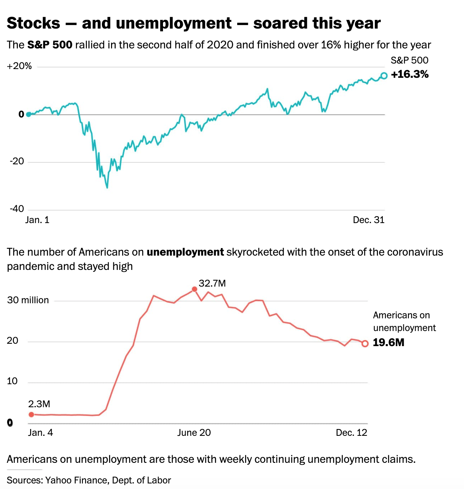
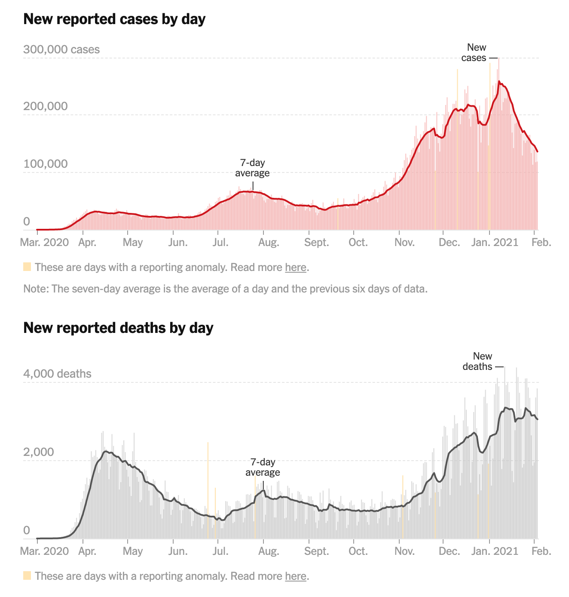

 
 刚刚过去的2020年应该说是灾难危机的一年，非常特别的一年，当一月份还在为科比意外去世惋惜时，新冠病毒，黑人运动BLM,，种族歧视，美国大选还有三月份的股市连续崩盘熔断，经济放缓，失业率暴增，随后的美联储救市，财政刺激，在美国新冠死亡人数不断创新高的情况，股市一路高歌猛进，中间也有黄金的暴涨，到了年尾有比特币的暴涨，贫富差距加大。 大选上，特朗普在普遍媒体民调不看好的情况（[甚至90%上会败给拜登](https://projects.economist.com/us-2020-forecast/president) )，结果出其意料的跟拜登不相上下，后面一系列指控选举舞弊（Stop the steal），甚至在今年1月6号发生了支持者冲突国会的暴力事件，拜登斥责[某些共和党人像是纳粹的宣传部长](https://thehill.com/homenews/administration/533449-biden-says-cruz-other-republicans-responsible-for-big-lie-that-fueled)，而特朗普也被社交媒体禁言 - 党派分裂的趋势越来越强。作为程序员可能尽管个人跟经济打的交道不多，但是每天都能接触到很多经济方面的术语”放水“、”比特币“、"股市“、”熔断“、”黄金“、”美联储”、“央行”、“通胀”等等，这些社会热点被动输入到我的大脑中，很多时候就是一看而仅此而已。之前难得有空在老家待了一阵，突然想起来之前一直狂轰乱炸的那些文字概念，回头一想，可能是一个学习了解新事物-货币和经济运行机制-的好机会。毕竟我们每天都跟钱打交道，却是很少去思考现象背后的运行的规则是怎么样的，这是个好机会重新挖掘一下自己的已有的知识，有哪些持有的印象概念是对的，有哪些肤浅的，整理归纳顺便学习新的知识，应该是蛮有意思的。我个人不是经济专业的，没有系统学过经济方面的知识，文章里写下的就是我私下觉得有趣然后花了点时间慢慢看学习，结合自己的实际观察，吸收总结归纳的一些见解，应该是有很多疏漏，可以指正的。

 
 

我们经常听到了一些看`人们常说`的说法和观点比如股市是经济的晴雨表、当比特币暴涨的时候很多人说比特币涨的原因就是美联储放水、当比特币跌的时候人们说比特币的价值本来就是0，量子计算机的超强算力就会轻易的破解加密算法使得其价值归0、美国股市一定是处于大的泡沫随时可能崩塌、美联储是私人银行家的掌控的是一个巨大的阴谋等等吧，这些说法和观点一直困扰我，虽然我无法肯定是否对错。但是这些观点和看法使我立马想到了黑格尔哲学里辩证法说的静止和抽象。以我浅薄的理解，黑格尔的“合理的内核”中的辩证法认为是实在真理（他认为的绝对精神Geist）是不断运动、变化、发展的，每个环节每一个方面都不是固定不动相互绝缘的，他们之间存在着内在的联系和转换。”具体“真理也就是是多样性的有机统一的，包含着事物不同方面有对立也有矛盾（抽象），因此它们不是静止和固定不动的，而是能互相转化和矛盾发展。”具体“指的是多样性的有机整体，"抽象”是是隔离的片面的局部。比如花如果是一个整体的话（具体），它具有很多特质但是它不是这些特质的堆叠，比如颜色，气味，形状等等。而花的某一个性质比如“颜色”，就是从整体中抽出来的，使得跟其他特质撕裂开来，那么颜色就是一个“抽象”。黑格尔认为世界上的事物都是具体的，都是许多方面、因素或性质的内在联系着的统一体，无论在天上或地下，无论在精神界或自然界，绝没有“抽象的”、孤立的事物；任何事物如果把它绝对孤立起来，那是毫无意义的。

所以联系起来就是这些描述让我感觉只是描述一个事物的某一个方面和某一个时间的静止的状态，自然的就会反问到会不会尤其没有其他方面，它的历史是怎么样的，怎么演变发展到这个阶段的，将来会是怎么样了。这种目前的-特别是不符合常理的-现象体现出来的矛盾性是不是能体现其本身内在这个阶段的本质，这个论断是不是有道理有逻辑支持，还是只是简单情绪的表达和发泄。不管怎么样，这都值得让人“叮咚”一下，诶，提醒自己保持好奇可以尝试验比较下自己的已有的印象和认知。

关于美联储今日的问题，某项经济制度和措施可能目前来看是有问题的，但是如果不仔细研究其历史和背景，不得出具体的分析和逻辑思辨，简单的认为只要推到就可以解决一时之问题，先不论是不是能解决当前问题，还要看看说这话之人是否可以拿出切实详实的新秩序的方案，否则只是一时之愤，可能甚至被利用或是悔不当初。就像这位老哥一样[“I toppled Saddam’s statue – now I want him back" BBC News](https://www.youtube.com/watch?v=z9wC6W7EJpg&ab_channel=BBCNews).

另外正如钱穆先生在[《中国历代政治得失》](https://book.douban.com/subject/1003479/)中讲的：

> 某一项制度之逐渐创始而臻于成熟，在当时必有种种人事需要，逐渐在酝酿，又必有种种用意，来创设此制度。这些，在当时也未必尽为人所知，一到后世则更少人知道。但任何一制度之创立，必然有其外在的需要，必然有其内在的用意，则是断无可疑的。纵然事过境迁，后代人都不了解了；即其在当时，也不能尽人了解得；但到底这不是一秘密。在当时，乃至在不远的后代，仍然有人知道得该项制度之外在需要与内在用意，有记载在历史上。这是我们讨论该项制度所必须注意的材料。否则时代已变，制度已不存在，单凭异代人主观的意见和悬空的推论，决不能恰切符合该项制度在当时实际的需要和真确的用意。

一项制度可能发展久了到慢慢僵化了现在看来有问题就一味批判就一无所用全盘否定是不合适的；也不能用现在的观点和场景去套用在过去的事物上，当时事物有当时的发展形势和出发理念，只有学习借鉴批判才能更好的应对当下，时代意见不能抹杀历史意见。

秉承这样的思路，我梳理了下钱和美联储的历史，然后分析了下当前的形势。